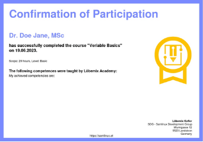
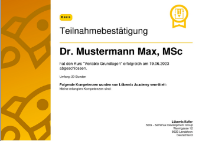

# VERIABLE Templates
A demo showcase of different possibilities to create conformations of participation and examination certificates.

## How to use these templates
Follow the guide to use one of these templates as VERIABLE templates.

## List of available templates
| ID | Preview | Type |Lang | Description | Link |
| --- | --- |--- |---|---|---|
| `1` |  | k | de | Description | [template](./templates/de_k_1.html) |
| `1` |  | k | en | Description | [template](./templates/en_k_1.html) |
| `1` |  | z | de | Description | [template](./templates/de_z_1.html) |
| `1` |  | z | en | Description | [template](./templates/en_z_1.html) |
| `2` |  | k | de | Description | [template](./templates/de_k_2.html) |
| `2` |  | k | en | Description | [template](./templates/en_k_2.html) |
| `2` |  | z | de | Description | [template](./templates/de_z_2.html) |
| `2` |  | z | en | Description | [template](./templates/en_z_2.html) |
| `3` |  | k | de | Description | [template](./templates/de_k_3.html) |
| `3` |  | k | en | Description | [template](./templates/en_k_3.html) |
| `3` |  | z | de | Description | [template](./templates/de_z_3.html) |
| `3` |  | z | en | Description | [template](./templates/en_z_3.html) |