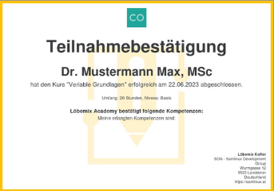
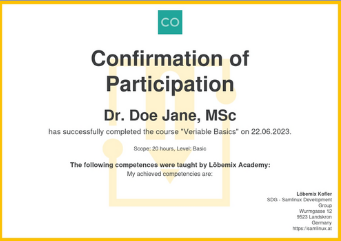
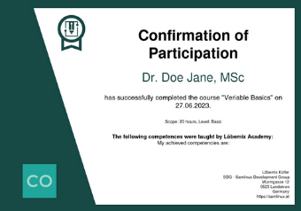

# VERIABLE Templates
A demo showcase of different possibilities to create conformations of participation and examination certificates.

## How to use these templates
Follow the guide to use one of these templates as VERIABLE templates.

## List of available templates
| ID | Preview | Orientation |Lang | Description | Link |
| --- | --- |--- |---|---|---|
| `1` |  | landscape | de | Teilnahmebestätigung | [template](./templates/de_k_1.html) |
| `1` |  | landscape | en | Confirmation of participation | [template](./templates/en_k_1.html) |
| `1` |  | landscape | de | Zertifikat | [template](./templates/de_z_1.html) |
| `1` |  | landscape | en | Certificate | [template](./templates/en_z_1.html) |
| `2` |  | landscape | de | Teilnahmebestätigung | [template](./templates/de_k_2.html) |
| `2` |  | landscape | en | Confirmation of participation | [template](./templates/en_k_2.html) |
| `2` |  | landscape | de | Zertifikat | [template](./templates/de_z_2.html) |
| `2` |  | landscape | en | Certificate | [template](./templates/en_z_2.html) |
| `3` |  | landscape | de | Teilnahmebestätigung | [template](./templates/de_k_3.html) |
| `3` |  | landscape | en | Confirmation of participation | [template](./templates/en_k_3.html) |
| `3` |  | landscape | de | Zertifikat | [template](./templates/de_z_3.html) |
| `3` |  | landscape | en | Certificate | [template](./templates/en_z_3.html) |
| `4` |  | landscape | de | Teilnahmebestätigung | [template](./templates/de_k_4.html) |
| `4` |  | landscape | en | Confirmation of participation | [template](./templates/en_k_4.html) |
| `4` |  | landscape | de | Zertifikat | [template](./templates/de_z_4.html) |
| `4` |  | landscape | en | Certificate | [template](./templates/en_z_4.html) |
| `5` |  | portrait | de | Teilnahmebestätigung | [template](./templates/de_k_5.html) |
| `5` |  | portrait | en | Confirmation of participation | [template](./templates/en_k_5.html) |
| `5` |  | portrait | de | Zertifikat | [template](./templates/de_z_5.html) |
| `5` |  | portrait | en | Certificate | [template](./templates/en_z_5.html) |
| `6` |  | landscape | de | Teilnahmebestätigung | [template](./templates/de_k_6.html) |
| `6` |  | landscape | en | Confirmation of participation | [template](./templates/en_k_6.html) |
| `6` |  | landscape | de | Zertifikat | [template](./templates/de_z_6.html) |
| `6` |  | landscape | en | Certificate | [template](./templates/en_z_6.html) |
| `7` |  | landscape | en | Certificate | [template](./templates/en_z_7.html) |